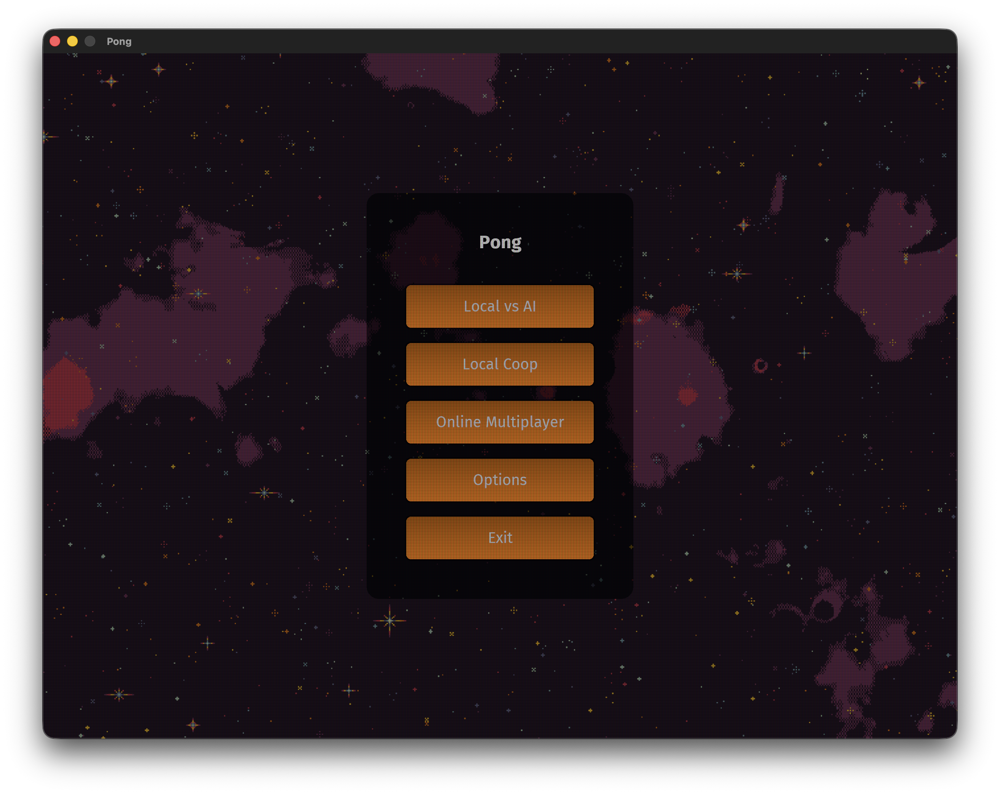
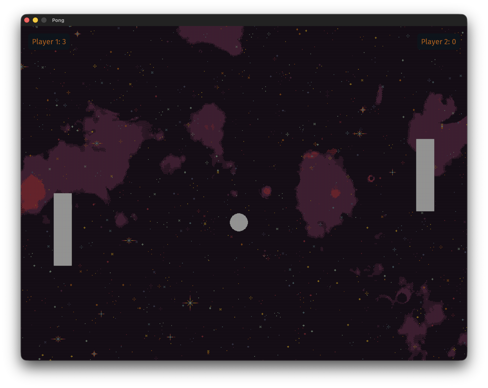

# Pong

[](https://github.com/oxylusengine/Pong/actions/workflows/xmake.yaml)

Multiplayer Pong made in [Oxylus](https://github.com/oxylusengine/Oxylus). It doubles as an example
project: a complete game whose gameplay, UI and netcode live entirely in Lua, with C++ used only for
app startup and one custom render pass.

<p align="center">
  
</p>
<p align="center">
  
</p>

## Playing

Grab the zip for your platform from [Releases](https://github.com/oxylusengine/Pong/releases),
extract it anywhere and run `Pong`. Everything the game needs is inside the folder.

- **Local vs AI** / **Local Coop** — player 1 uses Up/Down, player 2 uses W/S.
- **Online Multiplayer** — one side hosts on a port, the other joins with an IP and port. Both
  players ready up in the lobby and the host starts the match. Online you drive a single paddle, so
  either key set moves it.

On macOS the build is unsigned, so clear the quarantine flag once with
`xattr -dr com.apple.quarantine Pong-macos-arm64`. On Linux you need a Vulkan driver for your GPU.

## How it works

`Pong/src` is deliberately thin. `App.cpp` builds the `ox::App` with `DefaultModules` and registers
`pong::Game`, which loads `main_scene.oxscene`, imports `scene.lua` as a script asset and calls
`runtime_start()`. From there the scene's Lua systems are the game. `Game::update` also runs a CRT
post-process pass over the rendered scene, compiled from `Assets/Shaders/crt.slang` through the
`game.toml` manifest into `game.oxpack`.

Everything else is in `Pong/Assets/Scripts`:

| Script | Role |
| --- | --- |
| `scene.lua` | Entry point. Spawns paddles, ball and walls, and defines the flecs systems that move them. |
| `components.lua` | `PlayerComponent` and `BallComponent`, declared with `Component.define`. |
| `ui.lua` | RmlUI documents and the menu state machine, including the online lobby. |
| `network_controller.lua` | Session layer over `NetworkManager`: hosting, joining, lobby state and RPCs. |
| `assets.lua` | Sprite loading through `AssetManager`. |
| `config.lua` | Tunables: speeds, network tick rate, interpolation gains. |

The UI is RmlUI: `Assets/UI/ui.rml` holds every panel, `style.rcss` styles them, and `ui.lua` toggles
which one is visible and binds the score to a data model.

### Networking

The host is a player, not a dedicated server, and it owns the simulation. Both sides exchange
[enet](https://github.com/zpl-c/enet) RPCs registered with `register_proc`:

| Proc | Direction | Channel | Payload |
| --- | --- | --- | --- |
| `ready` | client → host | reliable | ready flag |
| `lobby` | host → client | reliable | both ready flags |
| `start` | host → client | reliable | match begins |
| `input` | client → host | unreliable | paddle direction |
| `state` | host → client | unreliable | paddle Y, ball position and velocity |
| `score` | host → client | reliable | scores and who scored |
| `round` | host → client | reliable | ball relaunched |

Only the host runs goal detection, bounce angles and scoring. The client applies each snapshot and
dead reckons on the velocities in between, predicts its own paddle from local input, and eases the
opponent's paddle towards the last position it heard about. Snapshots go out at
`Config.NET.TICK_RATE` (30 Hz).

## Building

Requires [xmake](https://xmake.io), the [Vulkan SDK](https://vulkan.lunarg.com/sdk/home) and a C++23
compiler. Oxylus is pulled in as an xmake package, so there is no engine checkout to manage.

```bash
xmake f --toolchain=clang --runtimes=c++_static -m debug
xmake build
xmake r Pong
```

Pick the toolchain for your platform (`clang-cl` on Windows, `mac-clang` on macOS, `nix-clang` on
NixOS) — see `xmake/toolchains.lua`. Modes are `debug`, `release` and `dist`.

Scripts and assets are copied next to the binary by the build, so iterating on gameplay is a plain
`xmake build` with no C++ to recompile. Pressing <kbd>R</kbd> in game reloads the RmlUI document and
clears the style cache.

## Releases

Pushing a `v*` tag builds the release configuration for Windows, Linux and macOS and publishes the
three playable zips to GitHub Releases. Pushes to `main` build and upload the same zips as workflow
artifacts without publishing a release.
